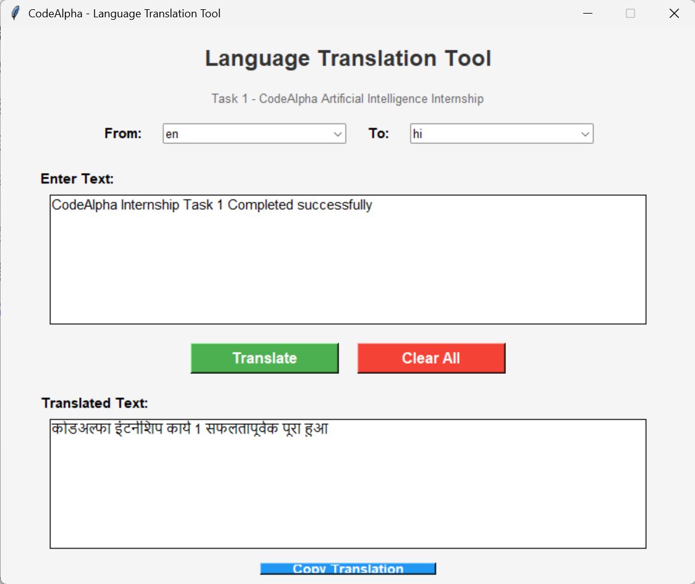

# CodeAlpha AI Internship - June 2026

## Domain: Artificial Intelligence

### Task 1: Language Translator 
Python program that translates text between multiple languages using Google Translate API. Auto-detects input language and gives instant output with pronunciation.

**Tech Stack:** Python, Googletrans, NLP

**Features:**
- Auto language detection
- Supports 100+ languages 
- Simple CLI interface

**How to Run:**
```bash
pip install googletrans==4.0.0-rc1
python translator.py
*'*
Output Screenshot:

#CodeAlpha#AI#ArtificialIntelligence#Task1#Python
